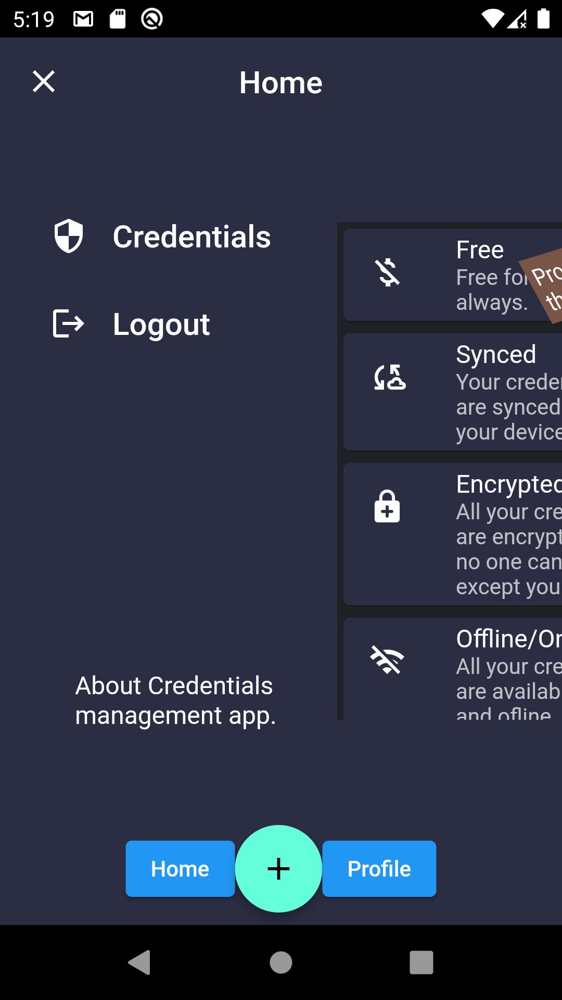

# credentials management

App for managing your credentials in one place.

## Description

- Firebase for storing credentials on the cloud.
- Google login
- Hive for offline storage
- connectivity_plus for listening and checking the network
- Storing the credentials in local when the user is offline and syncing with the cloud data when becomes online again.
#### Screenshots

<table>

<tr>
 <td style="text-align: center, width: 180">
   
   Home
  </td>

   <td style="text-align: center, width: 180">
   
   Drawer
  </td>

  <td style="text-align: center, width: 180">
   
   Credentials
  </td>
</tr>

<tr>
 <td style="text-align: center, width: 180">
   
   Create credentials
  </td>

   <td style="text-align: center, width: 180">
   
   Login
  </td>

  <td style="text-align: center, width: 180">
   
   Login loading
  </td>
</tr>

<tr>
 <td style="text-align: center, width: 180">
   
   Google login dialog
  </td>

   <td style="text-align: center, width: 180">
   
   Cancel login process
  </td>

  <td style="text-align: center, width: 180">
   
   Profile
  </td>
</tr>

</table>

